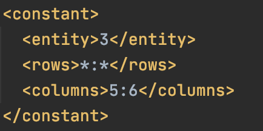
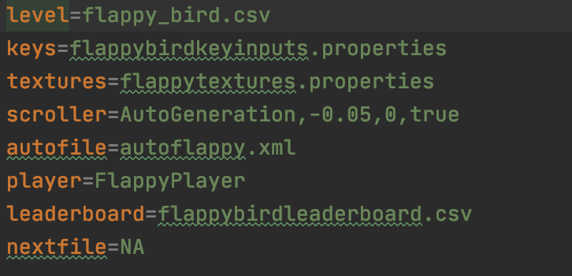

This file contains instructions on how to build an xml file that the AutoGenerator
class can use to automatically generate new levels at runtime. These files take 
a root element called "generator" that contains all of the elements necessary for 
the specification that determines what the generated 2D array of Strings looks like. 
The four elements that configure in this way are: "dimensions", "base", "random", and "constant".

* "dimensions" specifies the size of the chunk. It has two subelements.
  * "rows" specifies the number of rows in the new 2D String array to be generated
  * "columns" specifies the number of columns in the new 2D String array to be generated

* "base" specifies the default value for every value in the array. It has one subelement.
  * "entity" specifies the String that will be that default value. If, for example, this is
    set to "3", then unless "constant" and "random" instructions overwrite specific cells
    in the 2D array of Strings, all values in the 2D array will be "3"
    

    
* "constant" specifies a set of values that will be in every chunk. This could be applied
  if you knew you needed a floor in every chunk generated by the autogenerator. It takes 
  three arguments.
     * "entity" is the entity type (i.e. "2" for enemy)
     * "rows" is the row specification taking the form RowStart:RowEnd (i.e. 3:5)
     * "columns" is the column specification taking the form ColStart:ColEnd (i.e. 9:10)
     * Note: "*" as an argument to "rows" or "cols" means start at beginning or end (i.e. "rows" =
     * "*:9" means "0:9" and "cols" = "3:*" means "3:numCols"
     
   
  
* "random" specifies a set of values that will be in every chunk, but their location and
  size might change. For example, this would be applied if trying to randomly decide
  where to place a platform in the sky for a new DoodleJump chunk. It takes six arguments.
     * "entity" is the entity type (i.e. "2" for enemy)
     * "direction" is direction that this random instruction builds in (i.e. LEFT:UP)
     * "originrow" is the start row specification (i.e. 3)
     * "origincol" is the start column specification (i.e. 4)
        * Note, an argument of U(x:y) to either "originrow" or "origincol" means unifomrly generate 
        the start row or column in the range (x,y)
     * "numrows" is the width specification in the form of a Randomizer String
     * "numcols" is the height specification in the form of a Randomizer String
        * Note, a randomizer String is R(1,2,3;0.50,0.30,0.20) where the set of arguments before the
          semi colon is the set of valid values and the set of arguments after the semi-colon is the
          set of probabilities corresponding to each of those values
          

The final step in creating an autogeneration file is to include its name as a value for the key
"autofile" in a .properties file that specifies a game such as below:

