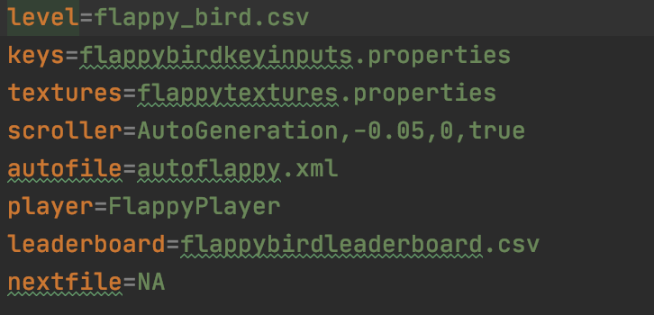

# Names of all people who worked on the project
  * Edem Ahorlu
  * Alex Lu
  * Mike Garay
  * Ryan Krakower

# Each person's role in developing the project

Edem Ahorlu: 
My role as a teammate is working on the frontend of the game.
I worked with Alex Lu, another frontend team member, to implement
various features including textures, splash screens, display enemies,
power ups, and scores among others. I also worked on the integration of front end and back
end.

Mike Garay:
My role was primarily working on the backend with Ryan.
Together, we implemented the entity hierarchy (entities are the building blocks
that make up our levels) and wrote the Level class. 
I was responsible for making the various interfaces used by the entities,
including power-up logic. I also worked with Alex to make LevelLoader and EntityFactory
to load in levels and create entities through reflection. Additionally,
I wrote basic game configuration and made the api package storing all of our interfaces for
the project.

Ryan Krakower:
My role was primarily working on the backend with Mike.
Together, we implemented the entity hierarchy (entities are the building blocks
that make up our levels) and wrote the Level class. 
I was responsible for the physics of entities, making the HitBox class and collision mechanics. 
I also wrote several of the entity classes, such as Player and Enemy. 
Additionally, I added the Doodle Jump and Flappy Bird texture packs.

Alex Lu: 
I worked on the front end of the game with Edem Ahorlu. I worked on the integration of front end and back
end. I also did a lot of work with controller and controller testing, and built 
the automatic level generation and scroller packages as well as their associated tests


# What are the project's design goals, specifically what kinds of new features did you want to make easy to add

Our project had three main design goals. First, we wanted our design to be data driven. We wanted
nothing to be hardcoded into our program, with all configuration for levels and stylesheets 
configured through .properties files. Please see below for an example .properties file that 
configures a level:



As one can see, we achieved our goal of having the config file take data inputs to build
a game rather than having the data hardcoded in. This data driven approach makes it easy
for us to build different types of levels for our three game types by changing the level structure 
file, scroller, automatic level generation configuration, gametextures and allowed key controls.

A second major design goal was substitutability, especially at runtime. We wanted the user to be 
able to change most of the interactive experience that they received when running our program.
All text displayed to the screen is derived from .properties language files, including error
messages, which display in different languages if necessary. The user can change this language file
that determines text as well as the stylesheet and texture pack to any valid substitute by clicking
buttons in the UI. Additionally, the user can rebind keys as they desire during game time.

Finally, we wanted our design to be extensible. We built the Scroller and Entity inheritance
hierarchies in ways that allow for the creation of new scroller classes with different behavior
or new Entity subclasses that acted or appeared differently. This is an example of our adherence 
to the open-closed principle, as we wanted those inheritance hierarchies to be open to 
extension, without needing to be changed.

# Describe the high-level design of your project, focusing on the purpose and interaction of the core classes

Our project is built around the model-view-controller pattern, with the model, view and 
controller packages being the three top level packages in src. 

First, in examining controller, the core class is GameController. Many of the other classes
in the controller package create objects that are contained in GameController's root node. 
To discuss the most important contributors, GameController uses ButtonBuilder to create buttons
for interactivity and it contains OptionsSelector objects which serve as visually robust ComboBoxes
which allow the user to choose from a list of choices. GameController reads the inputs from these
objects and then calls the dispatchEvent() method to alert the rest of the program that an event
has occurred.

Next, in examining view, the core class is GameView, which contains a GameModel object as instance
data and updates it every fraction of a second. During these updates it also uses Texturer to update
the position and existence of all textures on the screen. GameView also contains a list of different 
GameScene subclasses, all of which are contained in the scenes package and represent one type of
scene (i.e. menu scene, play game scene change key bindings scene, etc.) that the user might be
looking at at any given time. 

GameView receives the inputs from GameController by listening to the GameController in the current 
scene via the observer pattern. These can include key inputs, which it passes to the KeyInputter 
class to pass into the model, or button pushes, or selections on an OptionsSelector. Button pushes 
and selections on an OptionsSelector pass through the performReflection() method to be translated 
into method calls (i.e. each message passed to GameView by GameController has a String that will
result in a method call) that do things such as changing the GameScene on display or changing a
stylesheet or resource bundle.

Finally, in model there are five packages, scroll, entity, configuration, autogenerator and score.
The entity package contains the configuration for different Entity types like Player and Enemy, the
configuration class is responsible for translating a game .properties file like the one shown above 
into Level and GameModel objects, the scroll class scrolls the level by moving entity positions, 
the autogenerator package generates new chunks of levels to be explored during game time (i.e. 
infinite level generation for Doodle Jump) and the score package contains classes to keep track of 
high scores.

One primary classes in model, Level, represents an instance of the level that the player is on, 
and contains the controlled player object, which moves in response to key inputs, as well as a list
of entities. GameModel, on the other hand, is a forward facing class that receives update commands
from view, and also uses the configuration package to tell the view what to display (i.e. 
stylesheet, texture pack) based on the .properties file that configured the game being played.

# What assumptions or decisions were made to simplify your project's design, especially those that affected adding required features
   * We put a lot of our data files in the "resources" package instead of in "data"
   * We decided to place some of our test files in this package as well in order to circumvent issues
  related to not being able to locate test files if they weren't in the folder where the classes
  expected to find its files (i.e. a Texturer looks for textures in the 
  /src/resources/images/gameTextures folder)
   * Every entity is the same size and shape (a square). This assumption made it easier to 
  read/write levels and to make HitBoxes and collision mechanics. 
  The only downside is that it limits our options for resizing entities.
  * The game scene is always the same size.


# address significant differences between the original plan and the final version of the project
Our final version of the project was much like we had planned originally with the only significant differences
being additional features implemented. The features which made the final version of our project significantly
different from the original plan are giving the user the ability to set the keys to control characters in each version
of the game and letting the user apply different textures to game. Also, the final API was much more fleshed out
than what we had planned, since we underestimated how much interfacing would be necessary for the size of
the project.


# describe, in detail, how to add new features to your project, especially ones you were not able to complete by the deadline

### Adding new texture packs:
 1. Create a new package inside src/resources/images/gametextures.
 2. Add images (square images are better) to use for textures.
 3. Add a properties files to src/resources/images/texturefiles. The name of this file
 will be displayed to the user when prompted to select a texture for the game.
 4. Change the value of the texture keys in the properties file to point to the appropriate images.
  
 here is an example:
 
 ```properties
Block=src/resources/images/gametextures/mario/barrierblockbrown.png
Enemy=src/resources/images/gametextures/mario/beetle.png
Player=src/resources/images/gametextures/mario/luigi.png
PowerUpBlock=src/resources/images/gametextures/mario/powerupblock.jpeg
PowerUp=src/resources/images/gametextures/mario/powerup.png
Goal=src/resources/images/gametextures/mario/goal.png
```

In our program's current form, only these six keys are necessary 
to fully texture the game levels. If a texture
is missing, that entity will appear as a black square in View.

### Adding new Entity types
This is a bit tricker. Because we planned on making a few additional types of bricks, I will use 
a new brick type as an example.

* Adding a breakable brick: 
1. Make a new class, called BreakableBlock, that extends the appropriate class (in this case, Block) 
and implements any necessary interfaces (in this case, IDamageable). We will assume
that a breakable block can only be broken from the bottom, aka the colliding IDamageable
needs to be able to apply damage top-wise.

2. Make a mapping for it under the properties file src/resources/game_configuration/entityids.properties.
Give it a number as a key that is different from all the other keys, and make the value "BreakableBlock".

3. Make a level file that contains any entities you want to make up the level, including the new BreakableBlock
entity you just made. Put the path of that level file in the game configuration you are using to run
the game.

4. Make a texture pack mapping for it (see above).

5. Override the default method IDamageable#attemptApplyDamage in the Player class to allow
it to damage a BreakableBlock if it collides with it top-wise. Alternatively, amend the 
implementation of IDamageable#getAppliesDamageDirections in Player so Players can apply damage 
through a top-wise collision. 

6. Load up the game and play your level, now breakable blocks should be destroyed when the player
collides with it top-wise.
    
### Adding new game types

1. Make a new properties file under src/resources/game_configuration.

Here are the original mappings for supermario.properties as an example for what mappings you'd need to
make a default Super Mario Game: 

```properties
level=front_end_level.csv
keys=mariokeyinputs.properties
textures=mariotextures.properties
scroller=Manual,3,8,-1,-1
autofile=NA
player=MarioPlayer
leaderboard=supermarioleaderboard.csv
nextfile=mariolevel2.properties
```

"level" maps to the level CSV file you plan to use for the game.
"keys" maps to the properties file that contains the key inputs you want for your game type.
"textures" maps to the properties files that contains the textures you want for your game type. 
    Put NA if not desired.
"scroller" maps to the scroller arguments you want to pass in to the scroller.
"autofile" maps to the type of auto generation arguments you want to pass in to the auto generator.
    Put NA if not desired.
"player" maps to the name of the player class you want for your game type. 
"leaderboard" maps to the leaderboard CSV file you plan to use for scorekeeping.
"nextfile" maps to the properties file of the next level. 
    Put NA if not desired.

2. In the class src/view/scenes/SelectGameScene.java, add the name of your game type to the GAME_TYPES.
The name of the game type will be converted to lowercase and the spaces will be removed. The resulting
String must be the name of the properties file to use for the game configuration. For example, to add a new game
type called "Super Mario Galaxy", you would add "Super Mario Galaxy" to GAME_TYPES:

```java
public class SelectGameScene extends GameScene{
    
private static final String[] GAME_TYPES = {"Super Mario", "Flappy Bird", "Doodle Jump",
      "Mario Infinity", "Doodle Jump 2", "Super Mario Galaxy"};
}
```

in addition to naming your properties file supermariogalaxy.properties.

### Adding a new level

Create a new CSV file containing an assortment of entity ids to make up your level 
(see src/resources/game_configuration/entityids.properties). The best place to put it
so it can use the default path is at the top level of the data folder.

Here, 2 represents "Enemy", 3 represents "Block", 
5 represents "PowerUpBlock", 6 represents "MarioPlayer", 9 represents "Goal"
and anything else that doesn't have a mapping in entityids.properties is treated as "empty"
and doesn't add any entities to the level at those coordinates.

```
0,0,0,0,0,0,0,0,0,0,0,0,0,0,0,0,0,0,0,0,0,0,0,0,0
0,0,0,0,0,0,0,0,0,0,0,0,0,0,0,0,0,0,0,0,0,0,0,0,0
0,0,0,0,0,0,0,0,0,0,0,0,0,0,0,0,0,0,0,0,0,0,0,0,0
0,0,0,0,0,0,0,0,0,0,0,0,0,0,0,0,0,0,0,0,0,0,0,0,0
0,0,0,0,0,0,0,0,0,0,0,0,0,0,0,0,0,0,0,0,0,0,0,0,0
0,0,0,0,0,0,0,0,0,0,0,0,0,0,0,0,0,0,0,0,0,0,0,0,0
0,0,0,0,0,0,0,0,0,0,0,0,0,0,0,0,0,0,0,0,0,0,0,0,0
0,0,0,0,0,0,0,0,0,0,0,0,0,0,0,0,0,0,0,0,0,0,0,0,0
0,0,0,0,0,0,0,0,0,0,0,0,0,0,0,0,0,0,0,0,0,0,0,9,0
0,0,0,0,0,0,0,0,0,0,0,0,0,0,0,0,0,0,0,0,3,0,0,3,0
0,0,0,0,3,3,3,5,0,0,0,0,0,0,0,0,0,0,0,0,3,0,0,3,0
0,0,0,0,0,0,0,0,0,0,0,0,0,0,0,0,3,0,3,0,3,0,0,3,0
0,0,0,0,0,0,0,0,0,0,0,0,0,0,0,0,3,0,3,0,3,3,3,3,0
6,0,0,0,0,0,0,0,0,0,0,2,0,2,0,0,3,0,3,0,0,0,0,3,0
3,3,3,3,3,3,3,3,3,3,3,3,3,3,3,3,3,3,3,3,3,3,3,3,3
```

In your game's configuration properties file, map the level key to the name of this CSV file.
If it is not using the default path, then you will need to specify the full path.