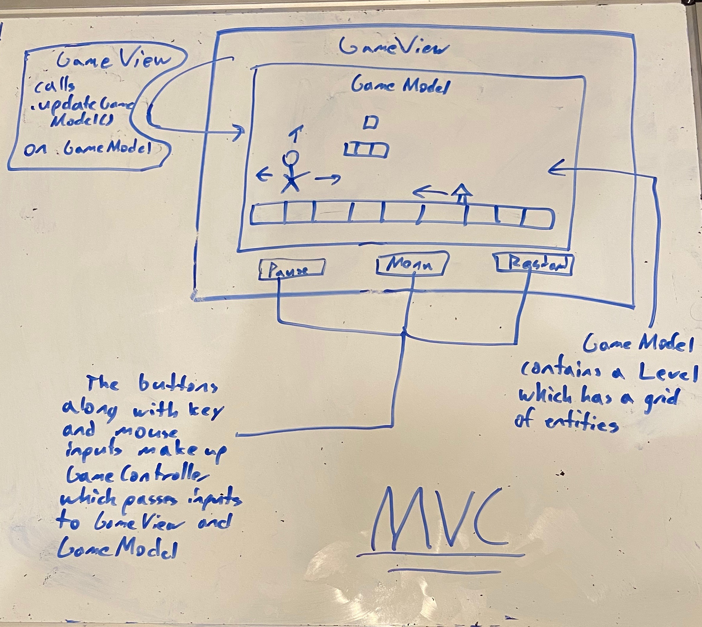
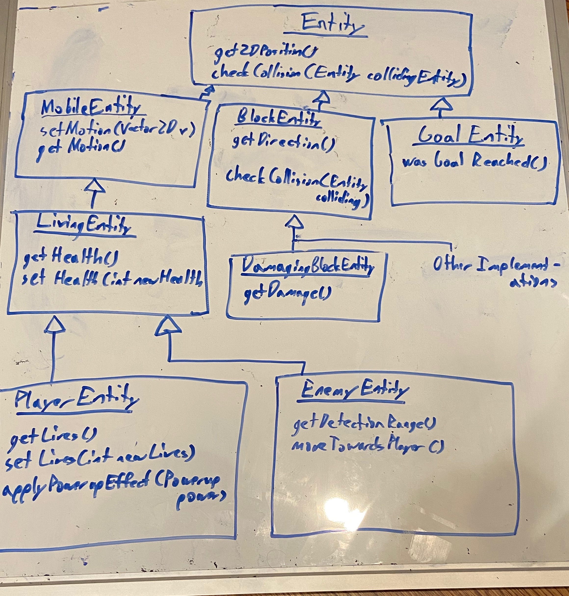
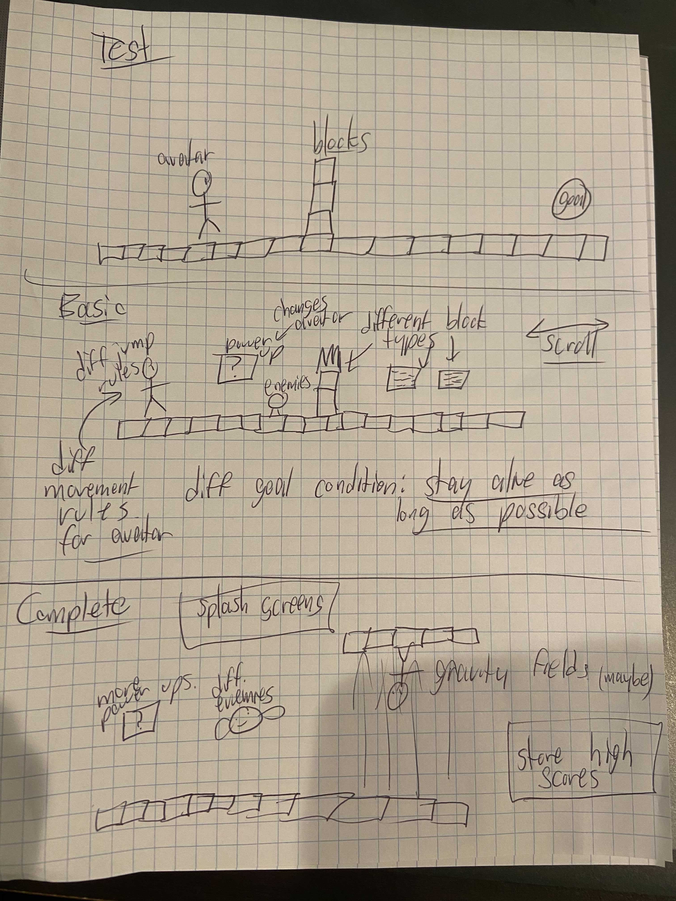

# OOGA Design Plan

## Introduction

We are making the OOGA project with the platformer genre. We're trying to represent games where the
player moves around a screen by pressing a few keys and tries to avoid obstacles that will result
in the player's death or damage. We want there to be a lot of flexibility in level design (i.e.
through csv files) and in terms of the scrolling mechanisms (i.e. the level automatically scrolls,
only scrolls in one direction, doesn't scroll etc.). We're planning on using the MVC design pattern
for our project.

We plan on filling each Scene with Entity objects, which are any objects that have a location 
and who react when touched by a player or by each other. These objects include the player, enemies, 
blocks, projectiles and powerups.

We want to be able to load at least three types of games with meaningfully different rule sets, such
as Mario, Flappy Bird, and Doodle Jump. This will be accomplished by having the data files change 
basic behaviors of the game engine, such as avatar type, scrolling behavior, and goal state. 

In addition to functionality, we will make sure that this program follows all design principles 
that we learned in class.

## Overview

* The primarily building block of our project is the Entity class. This represents any tangible object
that will be a part of gameplay (i.e. block, player, enemy). 
* Two subclasses, MobileEntity and BlockEntity extends this Entity with MobileEntity representing 
any Entity that moves and BlockEntity representing any Entity that doesn't, with various specific
subtypes extending those two classes.
* Two such important subclasses are PlayerEntity and EnemyEntity who both extend Entity and who 
represent the player and enemies respectively
* IRangedAttacker is an interface which allows ranged attacking
* Level represents all of the data for a single level and the LevelReader will read that
data from a file
* We also include a few helper classes such as Position2D and Vector2D to assist in
some of our calculations.
* We'll later write a class called Scroll to help determine which parts of the level will be visible
* GameModel is responsible for running and updating the game
* GameController is responsible for handling user input

## Design Details

* The primary methods for Entity are getID() which helps us to identify the Entity, getType() which 
helps us to know what the Entity is (i.e. Player1, Player2, etc.), get2DPosition() which returns the 
Entity's location and checkCollision(Entity collidingEntity) which checks for collision with another 
entity. There's also an enum of Type to help us figure out which Type is which.
* MobileEntity extends Entity and returns a 2DVector object describing where the Entity will go to 
next using getMotion(). It also updates its location through setMotion(Vector2D v)
* BlockEntity extends Entity and contains an enum of Directions that the block can be touched from.
It also overrides checkCollision(Entity collidingEntity) and determines what should happen on 
a collision
* GoalEntity extends Entity and serves as the endpoint of the Level. Calling wasGoalReached() on 
a GoalEntity object reveals if the user has reached the goal yet which will then trigger a level
switch
* IRangedAttacker is an interface whose primary method is useRangedAttack() which spawns a ranged 
attack
* LivingEntity extends MobileEntity and uses getHealth() and setHealth(int newHealth) 
to query and affect the amount of health available to the living entity
* PlayerEntity extends LivingEntity and contains various methods such as getLives() and 
setLives(int newLives) to reveal lives. Also, applyPowerupEffect(Powerup power) gives the 
player a powerup. This class heavily exploits the motion properties of MobileEntity while also 
implementing IRangedAttacker.
* EnemyEntity extends LivingEntity and uses getDetectionRange() and moveTowardsPlayer() to 
determine its behavior while also exploiting the motion properties of MobileEntity and
implementing IRangedAttacker
* PowerupEntity extends MobileEntity and contains an enum of ModifierType and returns that modifier
using getModifierAmount()
* ProjectileEntity extends MobileEntity and contains a method called getShooter() to determine who
fired it. It heavily exploits the motion properties of MobileEntity.
* Position2D is a location in 2D space that contains a x and y position and possesses four methods,
getters and setters for x and y locations. It will be a variable that all Entity objects possess
in order to define a location
* Vector2D is a vector in 2D space that contains an x and y magnitude. It possesses four methods,
getters and setters for the x and y components. It will allow MobileEntity objects to represent
where they are moving to next
* Level is a class holding all of the data on a level. It includes an int[][] of its grid of
Entities. Level contains a GoalEntity (or it doesn't in which case the Level continues indefinitely
as in Flappy Bird or Doodle Jump) which it changes through setters and reveals through getters
* LevelReader is a class responsible for reading in a level with readLevel() and then building a 
level from it using createLevel()
* Scroll is a class that we will build for Complete in order to allow the view to shift
* GameModel is a class that handles the modeling of the game and is responsible for updating the 
game state through updateGame(). It also reveals the level through getLevel() and switches the
level through setLevel()
* GameView is a class that handles the visualization for our project. It primarily calls the 
updateGameModel() method that updates the GameModel that is stored within the GameView. This 
will be important as the view portion of our MVC model
* GameController is a class that handles the controller for our project. It primarily fires the
dispatchEvent() method which alerts the view that something has happened in the controller. This
will be important as the controller portion of our MVC model

## Example Games
* Super Mario Bros. Style Game - a platformer where the objective is to reach the end of the level.
The player will lose a life upon touching the bottom of the screen (missing a jump) or after 
touching enemies. The Scroll of the level will scroll from left to right "at will", meaning that 
as the player moves left, the screen will move with him, thus keeping him in the center, with 
the visible environment around the player doing the scrolling. The player will only have one jump,
and all subclasses of the Block class will be on the table (SpringingBlockEntity, BasicBlockEntity, 
DamagingBlockEntity) etc.

* Doodle Jump Style Game - a platformer where the object is to ascend to the greatest possible
height. The player will lose the game upon falling through the bottom of the screen (missing a 
jump). The scrolling will follow the player's location upwards, but will not scroll left or right,
and if the player falls through the bottom of the screen, no scrolling will happen and the player 
will die, making the Scroll a little different. The player will receive no jumps and instead 
will be launched upwards by SpringingBlockEntity or MovingBlockEntity subclasses of Block.

* Flappy Bird Style Game - a platformer where the object is to stay alive as long as possible 
while dodging damaging blocks. The Scroll are as follows: if the player touches the bottom of the
screen, they lose. If the player touches the top of the screen, the may or may not lose (to be
decided later). If the player touches any of the obstacles, they lose. The player will have 
infinite jumps and the screen will automatically scroll, moving the obstacles toward the player.
Only DamagingBlockEntity subclasses of BlockEntity will exist.

## Design Considerations
* One immediate design consideration is how we will be able to check to see which direction the 
player or entity is hitting a block from.
* Another design consideration is how to implement the inheritance hierarchy so that it
becomes easy for classes to extend it and also to define behavior for specific behavior within it
    * We discussed at length how to divide up this hierarchy and which classes should extend
    which classes settling on a situation where Entity is the
* Building scrolling mechanics will also be quite difficult and require careful design in order
to provide the flexibility as needed
* We discussed whether to put scrolling mechanics into the View or Model and ultimately decided
to put it in the View

## Visual Representation

First, please see a visual representation of how our view, model and controller will interact

Next, we have a drawing of the inheritance hierarchy we will anchor at Entity

Finally, a drawing of the types of levels that we aim to implement after Test, Basic and Complete
respectively.
